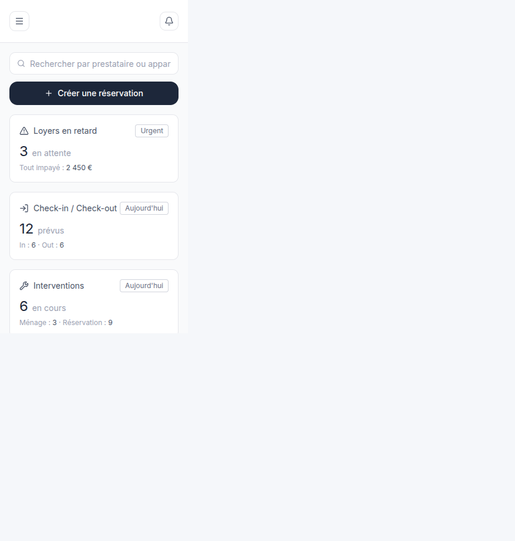
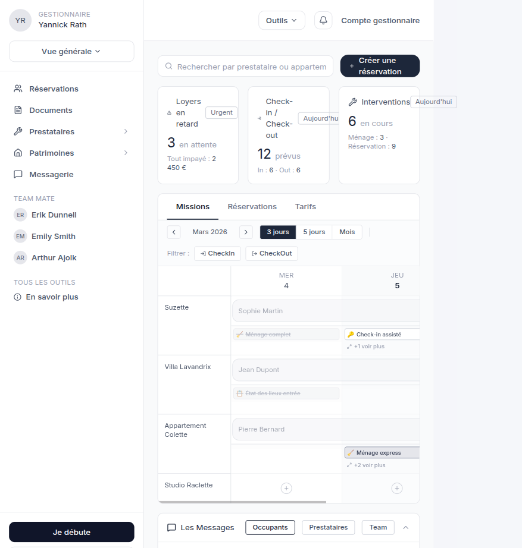

# AUDIT — Refonte responsive + UX/UI (Étape 1)

**Statut :** audit uniquement — **aucune modification de code** tant que ce document n’est pas validé.

**Date :** 18 août 2026  
**App :** Hublify Nexus (prototype gestionnaire)  
**Méthode :** 3 agents d’exploration (architecture, tokens/CSS, nav/a11y) + lecture du code + captures live sur `http://localhost:8080`.

---

## Contexte figé (placeholders du brief)

| Rubrique | Valeur constatée |
|---|---|
| **Stack** | React 19 + TypeScript + Vite 8 + **TanStack Start / Router** + Tailwind CSS v4 + shadcn/ui (New York, Radix) + Lucide |
| **Maquette** | Source unique : `public/V2 Redris (copie).fig` (V2 Redris / MO1). **Aucun frame mobile** dans cette source (`docs/FIGMAKE_CODE_AUDIT.md`). Pas d’URL Figma distante. |
| **Pages** | **Toutes** les 19 routes sous `AppShell` (voir inventaire) |
| **Cibles** | Chrome, Safari iOS, Android, tablette 768–1024, desktop 1440 / 1920 |
| **Ne pas casser** | Routes TanStack, store mock `src/data/store.ts`, vocabulaire UI, direction artistique MO1, kit shadcn existant. **Pas d’API, pas d’i18n, pas de dark mode actif.** |

**Règle de fidélité :** la maquette est desktop-first. Le travail mobile est une **extrapolation dans le langage visuel MO1** (navy `#1e2939`, gris `#101828`→`#99a1af`, cartes blanches, `rounded-[10px]`, Inter), pas une nouvelle direction artistique.

---

## 1. Inventaire composants code vs maquette

### 1.1 Écrans construits (19 routes)

| Route | Composant principal | Source maquette | Écart responsive |
|---|---|---|---|
| `/` | `KpiCards` + `PlanningGrid` + sections | Dashboard / Calendar / Missions | Planning `min-w-[720px]` en scroll interne |
| `/missions` | `MissionsCalendar` | Calendrier 3 jours / mois | Grille dense |
| `/missions/$missionId` | fiche mission | Voir infos missions | Formulaire OK |
| `/reservations` | `PlanningReservations` / `TableauReservations` | ReservationsPage | Toolbar dense ; filtres liste `hidden md:block` |
| `/reservations/nouveau` | `FormulaireReservation` | CreateReservationPage | Inputs `text-sm` / `h-[34px]` |
| `/occupants` | `ListeOccupants` | — (adapté) | **Table coupée** (`overflow-hidden`, pas de scroll) |
| `/documents` | `DocumentsApp` | DocumentsPage | Hub cartes **correct** ; listes internes en table 900px |
| `/prestataires` | cartes | Mes prestataires | Déjà en cartes + tokens `brand` |
| `/prestataires/nouveau` | formulaire | AddPrestataireForm | Relativement propre |
| `/prestataires/$id` | fiche | détail prestataire | OK |
| `/patrimoines` | `PatrimoineApp` | PatrimoinePage | Tables 700–900px (scroll X) |
| `/inventaire` | `InventaireApp` | InventoryPage | Table 900px |
| `/messagerie` | liste + fil empilés `< lg` | MessagingSection | **Liste + fil en même temps**, pas de retour |
| `/tarifs` | `PlanningGrid` | AnnualCalendar / tarifs | Idem planning |
| `/team` | `TeamPage` | TeamMatePage | Dialogs + menus custom |
| `/outils` | hub 5 cartes | inventé / regroupement | Déjà correct |
| `/outils/modeles` | `ModelesApp` | ModelesPage | Table 800px |
| `/outils/vue-annuelle` | `VueAnnuelle` | AnnualCalendarPage | Grille mois, cellules petites |
| `/profil` | page longue | ManagerProfileInfoPage | Colonne 389px dès `lg` |

### 1.2 Deux kits UI coexistent

| Kit | Où | Tokens |
|---|---|---|
| **shadcn** (`src/components/ui/*`) | Dialogs Radix, dropdowns, sheet **non branché** au shell | oklch sémantiques |
| **Primitives MO1** | Quasi tout le produit (`BtnNavy`, `Chip`, cartes hex) | **~1 200 hex en dur** |

Composants shadcn **disponibles mais non utilisés** pour le chrome : `Sheet`, `Drawer` (vaul), `Sidebar`, `Table`, `Form`/`Label`, `Button` métier.

### 1.3 Maquette vs code — écarts structurels

- Maquette : sidebar 255px permanente. Code : `hidden md:flex` — **comportement mobile inventé** (bandeau chips).
- Maquette : 0 frame mobile, 0 bottom nav (`docs/FIGMAKE_CODE_AUDIT.md`).
- Nav mobile actuelle **incomplète** vs sidebar : pas Inventaire, Modèles, Vue annuelle, Profil, Outils, Missions, Tarifs.
- Routes prestataires/missions utilisent `--brand` ; le reste ignore `styles.css` et peint en hex.

---

## 2. Points de rupture responsive (mesures live)

Captures dans `docs/audit/`. Largeurs testées : **320, 375, 768 (code), ~810 (tablette réelle), 1440 (desktop)**.

### 2.1 Synthèse overflow horizontal (body)

| Largeur | Page | `document.scrollWidth − clientWidth` | Verdict |
|---|---|---|---|
| 320 | Dashboard | **0** | Body OK ; placeholders tronqués |
| 375 | Dashboard | **0** | Grille planning 720px **confinée** (`overflow-x-auto`) |
| 375 | Réservations | **0** | Toolbar dense, chips qui wrap |
| 375 | Messagerie | **0** | Empilement liste+fil |
| 375 | Occupants | **0** (trompeur) | Table **906px clipée** par `overflow-hidden` — données inaccessibles |
| 375 | Documents hub | **0** | Meilleur écran mobile actuel |
| 810 | Dashboard | 0 | Sidebar + contenu : planning encore serré |
| 1440 | Dashboard | 0 | Conforme maquette |

**Aucun scroll horizontal de page** sur le dashboard grâce à `min-w-0` sur la colonne principale. Le vrai problème n’est pas le body : c’est le **contenu illisible ou clipé**.

### 2.2 320 / 375 px — téléphone



**Ce qui tient :** KPI empilés, CTA pleine largeur, cartes blanches, fond `#f9fafb`.

**Ce qui casse l’usage :**

1. **Navigation** — hamburger → bandeau chips horizontal, liens tronqués (`Pr…`), pas de drawer, pas de overlay, pas de `Escape`, pas de scroll-lock, pas de `aria-expanded`. Outils / Compte **absents** (`hidden sm:…`).
2. **Header** — 73px, deux cibles 32–34px (hamburger, cloche). Pas de titre sur la vue générale. Pas de safe-area iOS (`viewport-fit=cover` absent).
3. **Planning** — `min-w-[720px]` : l’utilisateur voit ~1 colonne (MER 4) et doit scroller ; pastilles `h-[21px]` / `text-[10px]` ; prev/next `size-6`.
4. **Occupants** — table 860px dans un parent `overflow-hidden` : colonnes Contact / Dates / Statut / Actions **invisibles**.
5. **Messagerie** — inbox + fil ouverts en même temps (très long scroll). 6 actions icône **28×28**. Composer `text-xs`. Pas de pattern « retour à la liste ».
6. **Réservations liste** — filtres période `hidden md:block` **sans équivalent mobile**.
7. **Inputs métier** — `text-sm` / `text-xs` → zoom iOS probable (< 16px). Aucun `inputMode`.

### 2.3 768 / 810 / 1024 px — tablette



- **768 pile :** sidebar 255px + ~513px de contenu. KPI passent en 3 colonnes (`md:grid-cols-3`) trop serrées.
- **640–767 :** ni sidebar ni « Outils/Compte » complets (header `sm`, sidebar `md`) → **trou de navigation**.
- **Messagerie** reste empilée jusqu’à `lg` (1024) : tablette portrait = même problème que le téléphone.
- Planning 3 jours encore trop large pour ~500px utiles.

### 2.4 1440 / 1920 — desktop

Conforme à la maquette (sidebar, header, grille). Hors périmètre de casse, hors tokens hex.

### 2.5 Fichiers à risque overflow / clipping

| Priorité | Fichier | Problème |
|---|---|---|
| P0 | `ListeOccupants.tsx` | `overflow-hidden` + `min-w-[860px]` **sans** `overflow-x-auto` |
| P0 | `AppShell.tsx` | Nav mobile inadéquate |
| P1 | `PlanningGrid.tsx` / `PlanningReservations.tsx` | Grille 720px ; `grid-cols-[1fr_80px×4]` hors scroll |
| P1 | `TableauReservations.tsx` | Table 880px OK en scroll ; filtres desktop-only |
| P1 | `messagerie.index.tsx` | `min-h-[calc(100vh-10rem)]` (pas `dvh`) + master-detail |
| P2 | Documents / Inventaire / Patrimoine / Modèles | Tables wrappées (scroll local) mais pas de vue cartes |
| P2 | `MenusOutils.tsx` | Panneaux `w-[288px]` en `absolute` |
| P2 | `DashboardDialogs.tsx` | `PopoverContent w-[360px]`, `grid-cols-4` |

---

## 3. Valeurs magiques et incohérences

### 3.1 Couleurs

Tokens oklch dans `src/styles.css` (`background`, `primary`, `brand`, `sidebar-*`, `.dark`).  
**Usage réel :** ~1 200 hex dans les features MO1.

Palette de facto (à tokeniser **sans changer le visuel**) :

| Hex | Rôle | Occurrences approx. |
|---|---|---|
| `#1e2939` | navy / action / texte fort | ~300 |
| `#e5e7eb` | bordure | ~260 |
| `#99a1af` | texte secondaire / placeholder | ~260 |
| `#4a5565` | texte corps | ~240 |
| `#f3f4f6` | fond soft | ~180 |
| `#6a7282` | muted | ~110 |
| `#f9fafb` | fond page | ~50 |
| `#101828` | CTA sidebar | quelques |

`.dark` est **mort** (jamais de `class="dark"`). Ne pas l’activer : les `bg-white` casseraient le thème.

### 3.2 Typo

Pas d’échelle display→caption. Arbitraires : `text-[9px]` / `[10px]` / `[11px]` partout (planning, badges). `ListeOccupants` titre `text-[28px]`. Pas de `clamp()`.

### 3.3 Espacements / rayons / hauteurs

- Échelle Tailwind 4px par défaut, **non respectée** : `h-[30|34|38|39|42|46|49|73]px`.
- `rounded-[10px]` × ~200 vs token `--radius: 0.75rem` (12px).
- Header `h-[73px]`, sidebar `w-[255px]`.

### 3.4 Z-index

Pas d’échelle nommée. Mélange `z-10` (header) / `z-20` (menus custom) / `z-40` (overlays maison) / `z-50` (Radix). Deux systèmes de modales (`InfosOccupants` custom vs `Dialog` shadcn).

### 3.5 `!important`

Quasi absent (seulement overrides shadcn sidebar, non utilisé).

### 3.6 Viewport

- `min-h-screen` / `100vh` (messagerie, error-page) — pas `dvh`/`svh`.
- Viewport meta **sans** `viewport-fit=cover`.
- Aucun `env(safe-area-inset-*)`.

---

## 4. Accessibilité (WCAG 2.1 AA)

| Sujet | État |
|---|---|
| Skip link « Aller au contenu » | **Absent** |
| Un seul `h1` | **Non** — `AppShell` pose un `h1` si `titre` ; `/reservations`, `ListeOccupants`, `FormulaireReservation` en ajoutent un second |
| Focus visible | shadcn OK ; features custom souvent `outline-none` |
| Contraste | `#99a1af` / `#d1d5dc` sur blanc + `text-[10px]` → **risque AA** (à confirmer, noter dans `UX-NOTES.md` si la maquette impose ce gris) |
| Touch ≥ 44×44 | Quasi jamais. Échantillon 375 messagerie : hamburger 34, cloche 32, outils fil 28, Écrire 28 de haut |
| `aria-expanded` / `aria-controls` | Hamburger et accordéons incomplets |
| Clickables non-boutons | `span role="presentation"` (dashboard), `<tr onClick>` (tables) |
| Modales custom | `InfosOccupants` : pas de focus trap, pas d’Escape, pas de `aria-modal` |
| `prefers-reduced-motion` | Non traité hors kit shadcn |
| Dialog close | libellé anglais « Close » |
| Inputs 16px | kit shadcn `text-base md:text-sm` — **non utilisé** par les formulaires métier |
| `inputMode` / `autocomplete` | **0 occurrence** |
| Pages 404/error | libellés **anglais** |

---

## 5. Navigation mobile — diagnostic (cœur du brief)

Comportement actuel (`AppShell.tsx`) :

```205:278:src/components/layout/AppShell.tsx
<button … className="… md:hidden" aria-label="Ouvrir la navigation">
  <Menu />
</button>
{mobileOuvert && (
  <nav className="flex gap-1 overflow-x-auto … md:hidden">
    {/* chips horizontaux incomplets */}
  </nav>
)}
```

| Attendu (brief) | Actuel |
|---|---|
| Drawer ou bottom nav **selon maquette** | Ni l’un ni l’autre — chips |
| Fermeture Escape + clic extérieur | Non |
| Blocage scroll arrière-plan | Non |
| Focus piégé | Non |
| Safe areas | Non |
| Nav complète | 8 liens vs sidebar complète |
| Ultra-simple | Chips tronqués, scroll horizontal caché |

`Sheet` et `useIsMobile` (768) existent déjà et **ne sont pas branchés**.

---

## 6. Décisions à valider (ne pas deviner)

La maquette **ne tranche pas** le mobile. Trois options, même langage visuel :

| Option | Description | Reco |
|---|---|---|
| **A — Drawer Sheet** | Réplique la sidebar (compte, Vue générale, nav, team, outils) en panneau gauche, overlay, Escape, scroll-lock, focus trap. Même IA. | **Recommandée** — fidèle à la maquette, `Sheet` déjà dans le projet |
| **B — Bottom nav 5 items** | Accueil / Réservations / Documents / Messagerie / Plus | Plus « app native », **absente de la maquette** |
| **C — Chips améliorés** | Garder le bandeau, le rendre scroll-snap + nav complète | Plus rapide, **pas** « ultra simple » |

**Autres questions bloquantes :**

1. **Planning** : garder un scroll X contenu (avec ombre + snap) **ou** vue « un jour / un bien » empilée sur mobile ?
2. **Tables** (occupants, réservations, inventaire, patrimoine, modèles) : **cartes empilées** (colonnes prioritaires) **ou** scroll X contenu avec indicateur ?
3. **Messagerie mobile** : liste pleine page → tap → fil avec bouton Retour (pattern master-detail) — OK ?
4. **Tokens** : extraire la palette MO1 en CSS variables **sans changer un pixel** de couleur — OK ? (Le `--brand` oklch actuel n’est pas la source de vérité visuelle.)

Tant que 1–4 ne sont pas tranchés, l’étape 3 (responsive) ne doit pas commencer sur les écrans denses.

---

## 7. Plan d’exécution par lots

Un lot = un commit. **Aucun lot avant validation de cet audit.**

### Lot 0 — Tokens (sans changer le rendu)

- Étendre `src/styles.css` : `--navy`, `--surface`, `--surface-elevated`, `--text-primary`, `--text-muted`, `--border`, `--radius-card: 10px`, hauteurs de contrôle, z-index nommés (`dropdown` → `toast`).
- Mapper `@theme inline` → utilitaires Tailwind. **Zéro hex nouveau dans les composants** ensuite.
- Documenter l’échelle dans un commentaire en tête de `styles.css` (pas de nouveau DS).
- `dvh` / `overflow-wrap` / `prefers-reduced-motion` de base.

### Lot 1 — Layout + navigation mobile (priorité absolue)

- `AppShell` mobile-first : Sheet drawer (option A, si validée), `aria-expanded`, Escape, overlay, scroll-lock, focus, safe-area, cibles 44px.
- Lien Compte + Outils dans le drawer.
- Un seul `h1` (titre page).
- Skip link.
- Fermer le trou 640–767.

### Lot 2 — Composants de densité

- Étendre `documents/ui.tsx` (`BtnNavy` 44px mobile, `Champ` `text-base` mobile, `Chip`).
- Tables → cartes **ou** scroll X avec fade (selon Q2).
- Corriger P0 Occupants (`overflow-x-auto` minimum, puis cartes).
- Planning : confinement + snap + barre d’outils qui wrap / menu « plus ».

### Lot 3 — Pages (une par une)

Ordre : Dashboard → Réservations (planning + liste + formulaire) → Messagerie → Occupants → Documents listes → Patrimoine / Inventaire / Modèles → Team / Profil → Missions / Prestataires (déjà plus propres) → Outils / Vue annuelle.

### Lot 4 — A11y + formulaires + polish

- Labels, `inputMode`, anti-zoom 16px, focus-visible, `aria-live` toasts, reduced-motion.
- Migrer `InfosOccupants` vers `Dialog`/`Sheet`.
- 404/error en français.
- Recette `QA.md` (320→2560, landscape, zoom 200 %, iOS Safari).

**Hors périmètre explicite :** rewrite, nouvelle lib UI, dark mode, logique métier, endpoints, glassmorphism.

---

## 8. Problèmes d’ergonomie maquette (à consigner dans `UX-NOTES.md` lors du lot, pas à « corriger » en silence)

1. Gris `#99a1af` / placeholders `#d1d5dc` vs AA.
2. Densité planning (pastilles 10px) illisible au doigt — contrainte maquette.
3. Cloche notifications non fonctionnelle (déjà documenté SOURCE).
4. Vocabulaire Occupant vs Voyageur (`docs/DECISIONS.md` vs UI Occupants).

---

## 9. Attente de validation

Merci de valider :

- [ ] Périmètre = **toutes** les routes
- [ ] Option nav **A / B / C**
- [ ] Planning mobile : scroll X snap **ou** vue jour
- [ ] Tables : cartes **ou** scroll X indiqué
- [ ] Messagerie : master-detail avec Retour
- [ ] Tokenisation hex MO1 sans changement visuel

Dès validation, démarrage **Lot 0** uniquement.
